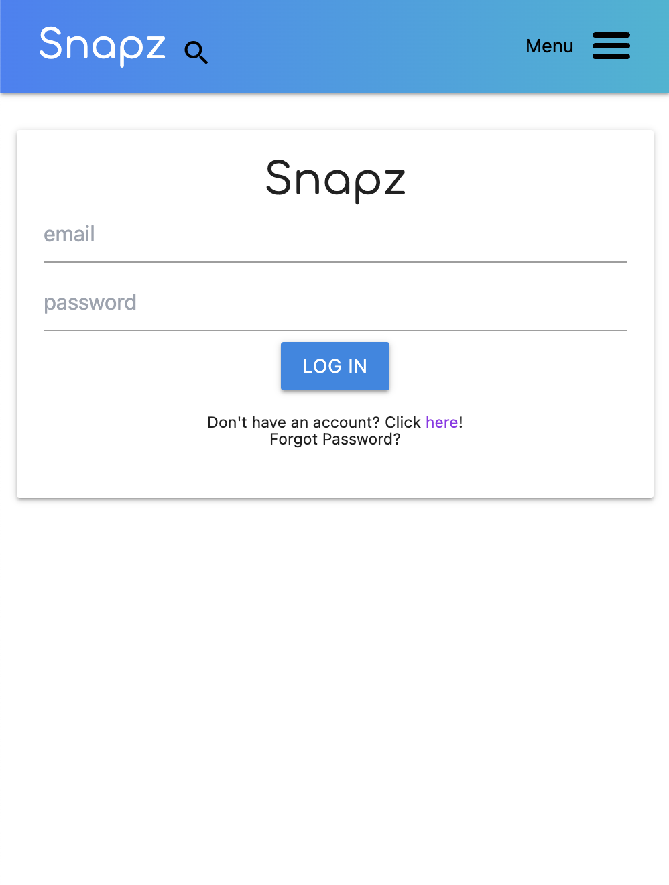

<div align="center">

# </br> **Snapz**

### WebApp Link: <a href="https://snapz.herokuapp.com/" target="_blank">https://snapz.herokuapp.com/</a>

## Social Media Application built using ReactJS and ExpressJS.

</div>

<br />

## Tech Stack

<code></code>
&nbsp;
<code></code>
&nbsp;
<code></code>
&nbsp;
<code></code>
<code></code>

## Additional Technologies

-  React Router
-  Materialize
-  JavaScript Web Token
-  Framer Motion
-  Cloudinary
-  Nodemailer
- Bcrypt
- Crypto
- <a href="https://dashboard.heroku.com/apps/snapz">Heroku</a>

## Build Setup

```bash
# install dependencies
npm install

# runs the app in the development mode.
npm run start

# builds the app for production to the build folder.
npm run build
```

## Visuals

<div>




</div>

## Deploys

[](https://dashboard.heroku.com/apps/snapz)

## Contributing

Feel free to dive in! [Open an issue](https://github.com/noahfajarda/snapz/issues/new) or submit PRs.

## Licensing

[](https://opensource.org/licenses/MIT)

## Notes

Optimize video uploads <a href="https://www.veed.io/edit/ca50d6ab-ef27-4fb6-9298-172ec99a0520/media">here</a>!

## Questions

If you have any questions or concerns, please contact me through my email below:

noahfajarda1@gmail.com

or through my github:

[https://github.com/noahfajarda](https://github.com/noahfajarda)

TODO:
replace local storage 'setItem' with context variables soon
be able to sign in with email OR username
